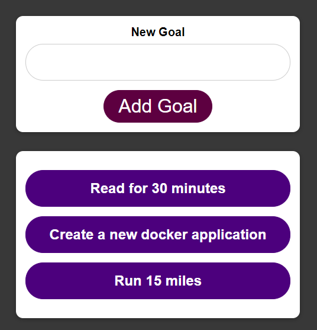

# Goals-Docker 

  ## Description

  A sample React/NodeJS/MongoDB application using Docker containers for the database, back end, and front end.  This is a simple goals application where goals can be added to the page and deleted. Goals are stored in a MongoDB database.

  ### Screenshot of app
  
  
  ## Table of Contents
  
  - [Installation](#installation)
  - [Usage](#usage)
  - [License](#license)
  - [Contributing](#contributing)
  - [Tests](#tests)
  - [Questions](#questions)
  
  ## Installation
  
  assuming you have Docker installed, type "docker-compose up" in the command line"
  
  ## Usage
  
  go to localhost:3000 in browser, type a goal in the input box, click on "Add Goal" button and it will be rendered on the screen and saved to the database.  Add as many goals as you want.  To delete a goal simply click on a goal item that has been rendered and it will be removed from browser screen and database.

  ## License
This application is covered under the MIT License.
 For more information: https://opensource.org/licenses/MIT
  
  ## Contributing
  N/A
  
  ## Tests
  N/A

  ## Questions
  Contact Info 
  GitHub user name: BillStephens2022 
  Link to GitHub profile: https://github.com/BillStephens2022 
  Email: stephensbill17@gmail.com